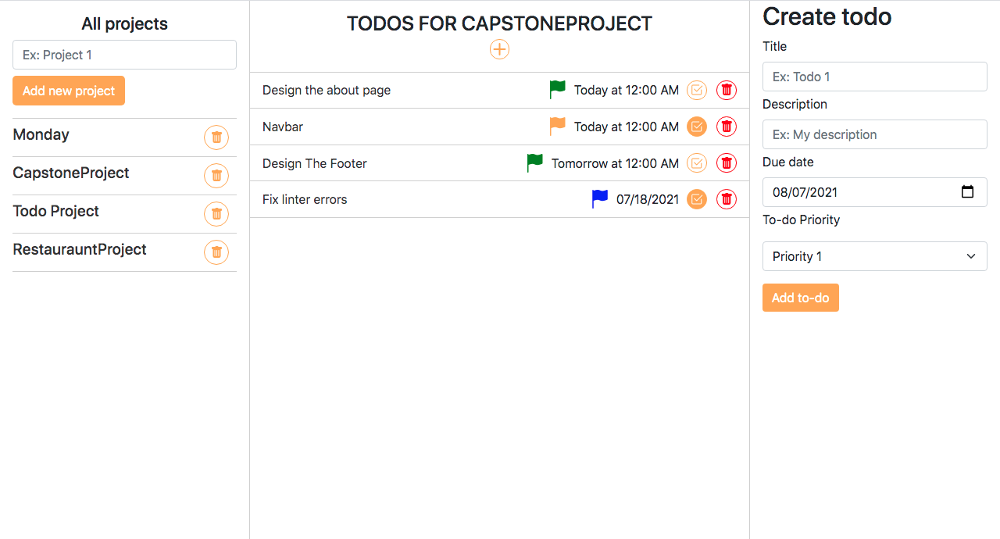

# Tasks Manager

> Task manager is website that helps you manage your tasks and projects, You have the posibility to to add Tasks to existings projects, create new projects, delete projects, modify or delete your tasks for a particular project.

This website was designed with the tools below:

## Built With

- Javascript
- CSS

## Getting Started

**To get the local copy of the project up and running you will need to run the following commands on your terminal:**

`git clone https://github.com/barackm/tasks-list`

To install all the available dependecies run:
`npm install`

To bundle and transpile the javascript code using webpack run:
`npm run build` for production, or:
`npm run dev` for development.

Now you can open up the index.html file (located in the dist directory in chrome) to see the result.

## Authors

👤 **Barack Mukelenga**

- GitHub: [@barackm](https://github.com/barackm)
- Twitter: [@BarackMukelenga](https://twitter.com/BarackMukelenga)
- LinkedIn: [Baraka Mukelenga](https://www.linkedin.com/in/baraka-mukelenga/)

👤 **Igor Koloski**

- GitHub: [@igorkol91](https://github.com/igorkol91)
- Twitter: [@Destro49536502](https://twitter.com/Destro49536502)
- LinkedIn: [Koloski Igor](https://www.linkedin.com/in/igor-koloski-a754aa208/)

## 🤝 Contributing

Contributions, issues, and feature requests are welcome!

Feel free to check the [issues page](https://github.com/barackm/tasks-list/issues).

## Show your support

Give a ⭐️ if you like this project!❤️❤️❤️

## Acknowledgments

- Microverse)
